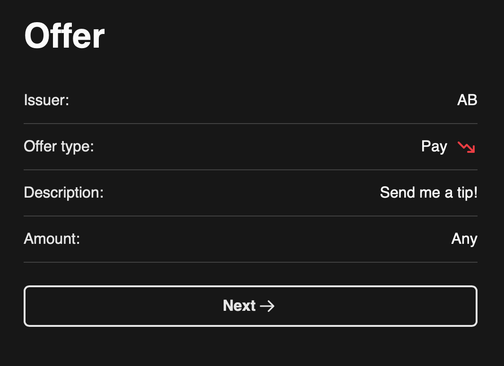
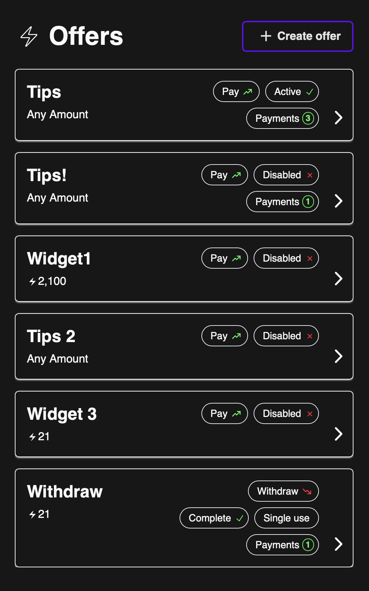
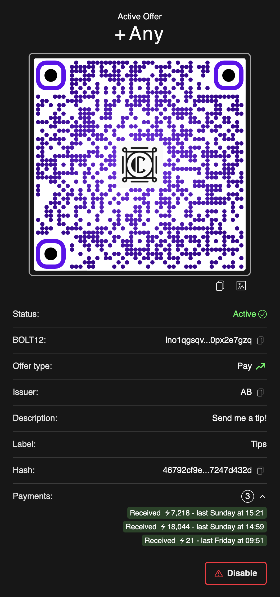

# BOLT12 Offers

BOLT12 Offers is a new standard for invoicing that brings some neat new features that are not possible with BOLT11 invoices (the current standard). You can create reusable static invoices for donations, create a QR invoice request that allows someone to withdraw from your node, denominate in fiat currencies, proof of payment and more. For more info on BOLT12 check out [BOLT12.org](https://bolt12.org).

!!! info

    To use the BOLT12 features in Clams, you will need to enable the [`--experimental-offers` flag](https://lightning.readthedocs.io/lightningd-config.5.html#experimental-options) in your Core Lightning config file.

## Scanning and Sending BOLT12 Offers

You can scan (via the scan button) or input manually (via the send button) a BOLT12 offer and the payment flow will guide you through to payment completion.

<figcaption style='font-size: small; margin: -1em 0 2em 0;'>BOLT12 offer summary after scanning QR</figcaption>

## Managing Offers

You can view all of your current offers listed with a brief summary of each one.

<figcaption style='font-size: small; margin: -1em 0 2em 0;'>Summary list of all offers</figcaption>

## Creating Offers

Creating an offer is simple and is guided by the BOLT12 payment creation flow for all the needed input. If you want to receive a payment, select pay. If you would like to allow someone to withdraw funds from your node, select the withdraw type.

<figcaption style='font-size: small; margin: -1em 0 2em 0;'>The first step when creating an offer</figcaption>

## Offer detail

Clicking on one of the offers in the summary list will show you the offer details. You can view all of the payments that have been made via that offer and can click through to see the payment details.

<figcaption style='font-size: small; margin: -1em 0 2em 0;'>Detail view of an offer</figcaption>

!!! info

    Clams does not currently support the recurrence features of BOLT12, but will support them once they are added back in to the spec.
