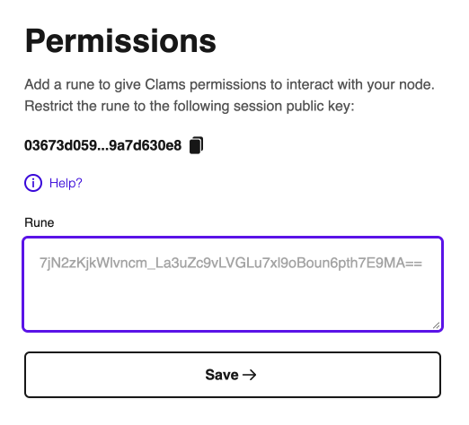

# Authentication

To allow Clams to securely interact with your node, you will need to provide it with a valid authentication token with the appropriate permissions. Core Lightning nodes use [rune authentication tokens](https://lightning.readthedocs.io/lightning-commando-rune.7.html) to specify permission to provide fine grained access to the node RPC server via the [Commando plugin](https://github.com/ElementsProject/lightning/blob/master/plugins/commando.c).


<figcaption style='font-size: small; margin: -1em 0 2em 0;'>Clams App Authentication</figcaption>

The app is expecting a valid Base64 encoded rune that you can generate via the [commando-rune](https://lightning.readthedocs.io/lightning-commando-rune.7.html) method on your lightning cli. You can create a rune that gives the app whichever permissions you are comfortable with and the app will gracefully fail and display an error message where appropriate indicating if it does not have adequate permissions to perform an action initiated within the app. Below we will include some rune recipes for common permissions groupings that will quickly get you going, but feel free to read the rune documentation to tweak to your liking.

You will see that a random public key has been generated within the app (displayed in the screenshot as **`031846f85...ff6ce330b`**) and can be conceptually thought of as a “session” id. The public key corresponds to a private key that will be stored locally and will be used when initiating a connection to your node, so the Clams app will always have a persistent node id when connecting. The purpose of this public key is that you can use it to restrict your rune so that only this node identity can use the provided rune. This provides an extra layer of security when working with runes that have the ability to send payments, which can be thought of as essentially private keys. The session secret, rune authentications token, and connection address are all stored in local storage on your device and you can optionally [encrypt these credentials](/encryption) with a 4 digit pin to ensure that they are only ever decrypted in memory. If you want to revoke access to your node, you can go in to the settings page and reset the app. All of your credentials will be deleted included the session secret, meaning the rune (restricted to the corresponding id) will no longer be valid for use.

All of the recipes below will be restricted to the node id: `031846f85514de33d0c807261aa4e801b5c0a45a3db5c1ffaf9af80eaff6ce330b`, but when you run the command to create a rune, make sure you replace it with the public key that you were provided in the app.

## Recipes

Be very careful when sharing and handling runes as they can function basically like private keys depending on the restrictions. It is highly recommended to always restrict any runes to the provided public key. We have also added rate limiting to all rune recipes to ensure that your node cannot get overloaded with RPC calls. Replace all instances of the `id=0318..` with the public key provided on the authentication screen.

### Readonly

The following rune will allow read only access to your node and encodes the following permissions:

- Read the balance of funds
- List payment history
- Can only make requests if the node has an id equal to the session public key
- Is rate limited to 60 requests a minute

```shell
#v0.12.x
lightning-cli commando-rune restrictions='["id=031846f85514de33d0c807261aa4e801b5c0a45a3db5c1ffaf9af80eaff6ce330b", "method^list|method^get|method=summary|method=waitanyinvoice","method/listdatastore", "rate=60"]'

#v22.x.x
lightning-cli commando-rune restrictions='[["id=031846f85514de33d0c807261aa4e801b5c0a45a3db5c1ffaf9af80eaff6ce330b"], ["method^list","method^get","method=summary","method=waitanyinvoice"],["method/listdatastore"], ["rate=60"]]'
```

<figcaption style='font-size: small; margin: -1em 0 2em 0;'>CLI command</figcaption>

```shell
_V6-OWCxC0uexq47DGclJg8bEPn7mAPx1VJ1XyPydhQ9MTMmaWQ9MDMxODQ2Zjg1NTE0ZGUzM2QwYzgwNzI2MWFhNGU4MDFiNWMwYTQ1YTNkYjVjMWZmYWY5YWY4MGVhZmY2Y2UzMzBiJm1ldGhvZF5saXN0fG1ldGhvZF5nZXR8bWV0aG9kPXN1bW1hcnkmbWV0aG9kL2xpc3RkYXRhc3RvcmUmcmF0ZT02MA==
```

<figcaption style='font-size: small; margin: -1em 0 2em 0;'>The resulting rune</figcaption>

### Lightning Payments

The following rune will allow full app(current) functionality and encodes the following permissions:

- Read the balance of funds
- List payment history
- Create invoices
- Pay invoices
- Send keysend payments
- Listen for invoice payment updates
- Can only make requests if the node has an id equal to the session public key
- Is rate limited to 60 requests a minute

```shell
#v0.12.x
lightning-cli commando-rune restrictions='["id=031846f85514de33d0c807261aa4e801b5c0a45a3db5c1ffaf9af80eaff6ce330b", "method^list|method^get|method=summary|method=pay|method=keysend|method=invoice|method=waitanyinvoice","method/listdatastore", "rate=60"]'

#v22.x.x
lightning-cli commando-rune restrictions='[["id=031846f85514de33d0c807261aa4e801b5c0a45a3db5c1ffaf9af80eaff6ce330b"], ["method^list","method^get","method=summary","method=pay","method=keysend","method=invoice","method=waitanyinvoice"],["method/listdatastore"], ["rate=60"]]'
```

<figcaption style='font-size: small; margin: -1em 0 2em 0;'>CLI command</figcaption>

```shell
KXmMos0AFEwsScl7EZ__CpfA4iT9mXcKI6nYq8_ZCS89MTQmaWQ9MDMxODQ2Zjg1NTE0ZGUzM2QwYzgwNzI2MWFhNGU4MDFiNWMwYTQ1YTNkYjVjMWZmYWY5YWY4MGVhZmY2Y2UzMzBiJm1ldGhvZF5saXN0fG1ldGhvZF5nZXR8bWV0aG9kPXN1bW1hcnl8bWV0aG9kPXBheXxtZXRob2Q9a2V5c2VuZHxtZXRob2Q9aW52b2ljZSZtZXRob2QvbGlzdGRhdGFzdG9yZSZyYXRlPTYw
```

<figcaption style='font-size: small; margin: -1em 0 2em 0;'>The resulting rune</figcaption>

## Rune Decoding

Once you input a rune, the app will automatically decode it and display it in a human readable form. Here is what the “readonly” recipe from above looks like:


<figcaption style='font-size: small; margin: -1em 0 2em 0;'>Clams App Rune Summary</figcaption>
