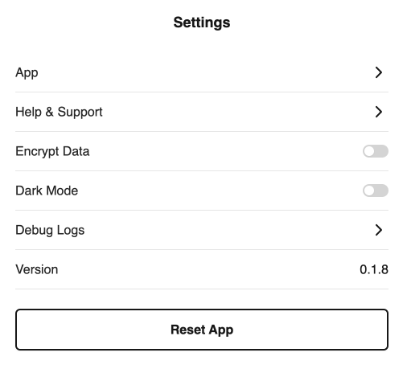

# Encryption

You can optionally encrypt all of the local data stored on your device with a 4 digit pin. This means that your data at rest is always encrypted and will be loaded in to memory and decrypted when you enter your pin.

1. Press the settings icon located at the top right of the home screen.
  <figure>
    
    <figcaption>Clams App Settings</figcaption>
  </figure>
2. Then toggle the “Encrypt Data” option to trigger the pin entry screen.
  <figure>
    
    <figcaption>Data encryption</figcaption>
  </figure>
3. Enter your 4 digit pin to encrypt your data.
4. You will now be asked for your pin number every time you reload the app to decrypt your data. If you forget your pin, you can reset the app which will delete all of the local data and the app will ask you to re-enter all of your credentials.
