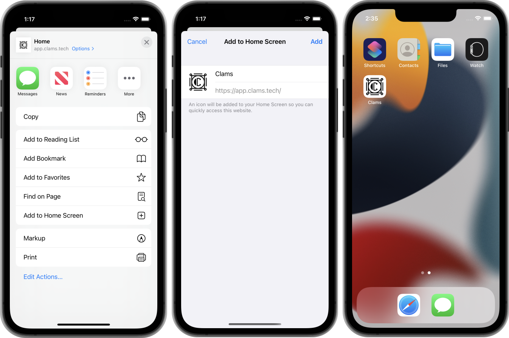
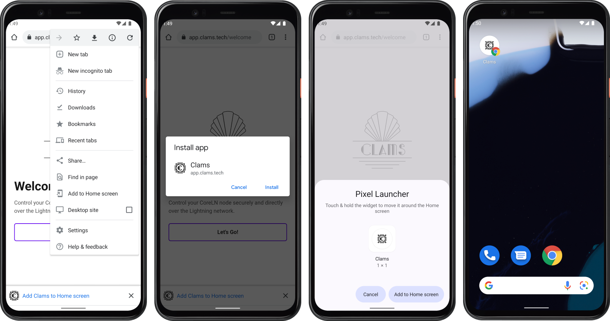
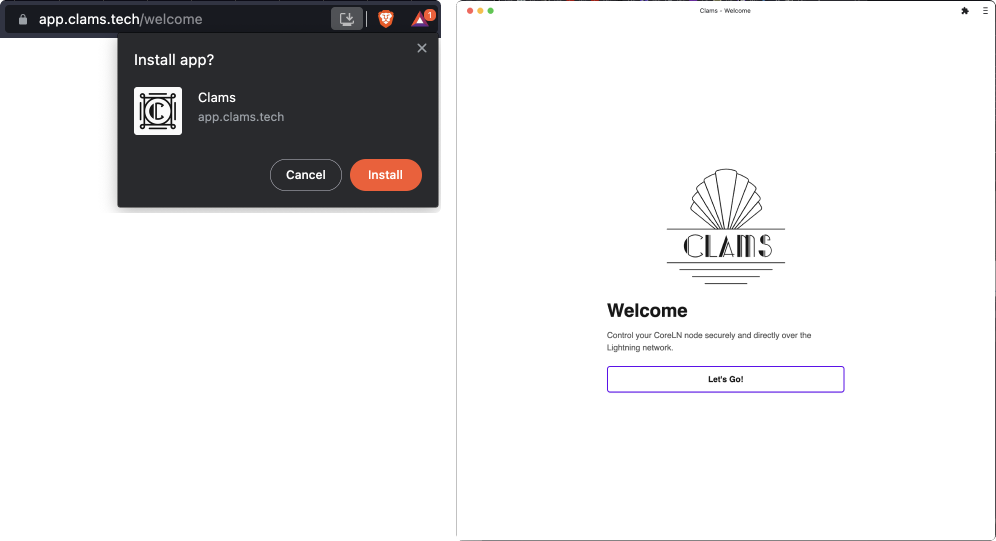

# Installation

Clams is a Progressive Web App (PWA), which means that you can install it locally to your device and it will look and feel like a native app that was installed from the app store.

## iOS / ipadOS

1. Press the share button at the bottom of the screen
2. Press “Add to Home Screen”
3. Press “Add”
4. Then you will see the Clams icon on your home screen

<figcaption style='font-size: small; margin: -1em 0 2em 0;'>iOS Install</figcaption>

## Android

1. Press the “Add Clams to Home screen” popup at the bottom of the screen
   1. If the popup is not there, then press the 3 dots up the top right
   2. Press “Add to Home screen”
2. Press “Install”
3. Press “Add to Home screen”
4. Then you will see the Clams icon on your home screen

<figcaption style='font-size: small; margin: -1em 0 2em 0;'>Android Install</figcaption>

## Desktop (Brave/Chrome)

1. Click the install icon in the address bar
2. Click “Install” button
3. Clams will now work like a standalone app

<figcaption style='font-size: small; margin: -1em 0 2em 0;'>Brave Install</figcaption>
